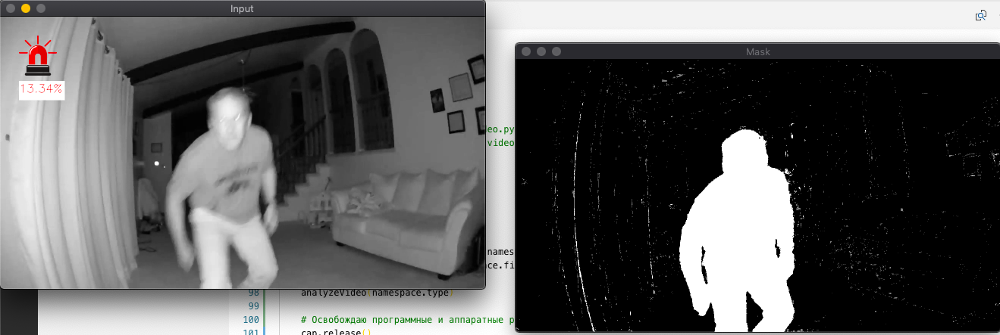

# MotionDetection
Лабораторная работа по компьютерному зрению в 13 триместре.

Определение движения при помощи алгоритма вычитания смеси гауссиан. Работает для статичного и динамичного фона — это задается параметром при вызове. Можно загрузить файл, а можно воспользоваться веб-камерой.



### Параметры запуска

```
python3 video.py [аргументы]
```

Аргументы: 
* -f или --file [путь к файлу]
* -t или --type [static || dynamic] 
* -i или --input [file || webcam]

Например, для файла со статичным фоном video_static.mp4 вызов будет таким:
```
python3 video.py -i file --file video_static.mp4 --type static
```

---

Forked from [@ksenksenon](https://github.com/ksenksenon) 💙
